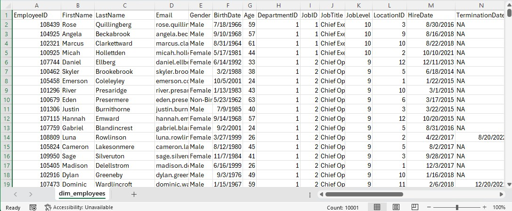
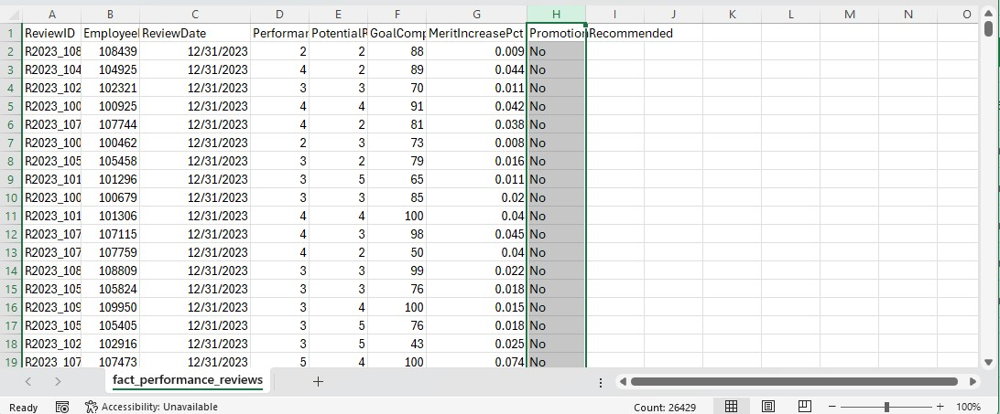
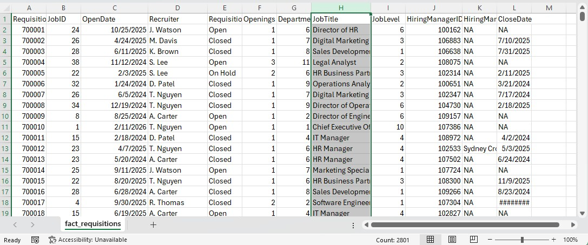

# Synthetic HR Analytics Database (R)

## Overview
This project demonstrates the design and generation of a synthetic enterprise-level HR and People Analytics database using R.

The dataset simulates a modern organization with 10,000 employees and includes workforce, recruiting, compensation, performance, engagement, and operational data across a relational data model.

This project is designed to showcase real-world skills in:
- Data engineering with R
- Synthetic data generation at scale
- Dimensional modeling (fact and dimension tables)
- People analytics and workforce insights
- Data preparation for SQL and BI tools

---

## Key Highlights

- 10,000 synthetic employees
- 15+ interconnected tables (dimension + fact)
- Enterprise-style HR data model
- Manager hierarchy and span of control
- Compensation history with salary progression
- Recruiting pipeline with candidate tracking
- Performance and engagement analytics
- Monthly headcount snapshots
- Automated CSV export pipeline
- Built-in QA validation checks

---

## Tech Stack

- **R**
- dplyr
- tidyr
- stringr
- purrr
- lubridate
- tibble

---

## Data Model

The dataset follows a dimensional structure used in analytics and data warehousing.

### Dimension Tables
- dim_employees  
- dim_employee_demographics  
- dim_departments  
- dim_jobs  
- dim_locations  

### Fact Tables
- fact_employee_current  
- fact_compensation_history  
- fact_promotions  
- fact_performance_reviews  
- fact_engagement_surveys  
- fact_learning_completions  
- fact_leave_events  
- fact_requisitions  
- fact_candidates  
- fact_headcount_monthly  
- fact_manager_span  

---
## Screenshots

### Employee Table Preview


### Performance Review Table Preview


### Requisitions Table Preview


---

## What This Project Demonstrates

### Data Engineering
- End-to-end synthetic data generation pipeline in R
- Scalable dataset creation (10K+ records)
- Structured export to analytics-ready CSVs

### People Analytics
- Workforce lifecycle modeling (hire → performance → promotion → attrition)
- Engagement and retention indicators
- Recruiting funnel and hiring metrics

### Data Modeling
- Dimension and fact table design
- Business-ready schema for BI tools
- Support for relational joins and KPI calculations

---

## Example Business Questions

- What is the attrition rate by department?
- Which job levels experience the highest turnover?
- How does performance relate to promotions?
- What is the average salary by job level and location?
- Which recruiting sources produce the most hires?
- What is the average time-to-fill by recruiter?
- How does engagement impact intent to stay?
- What is the average manager span of control?

---

## Project Structure

```text
synthetic-hr-analytics-database/
│
├── R/
│   └── synthetic_company_database.R
│
├── data/
│   └── (generated CSV files)
│
├── documentation/
│   └── (data dictionary and schema files)
│
├── screenshots/
│   └── (sample outputs and dashboards)
│
└── README.md
```
---

## How to Run
1. Clone the repository

2. Open the R script


3. Install required packages
```text
install.packages(c("dplyr", "tidyr", "stringr", "purrr", "lubridate", "tibble"))
```

4. Run the script

 The script will: 
- generate all tables
- run validation checks
- export CSV files to a local output folder

---

## Output

The project produces a complete analytics dataset including:

- Employee master data
- Compensation history
- Recruiting pipeline
- Performance reviews
- Engagement surveys
- Learning and leave events
- Monthly workforce snapshots

  

## This dataset is ready for:

- SQL database ingestion
- Power BI dashboards
- Tableau dashboards
- analytics case studies

---

## Next Steps

Planned enhancements include:

- SQL schema and table creation scripts
- Power BI dashboard with workforce KPIs
- Attrition and retention analysis
- ERD diagram and schema visualization
- Advanced analytics use cases

---


### Author

Joshua Watson

People Analytics | Data Analytics | HR Technology


